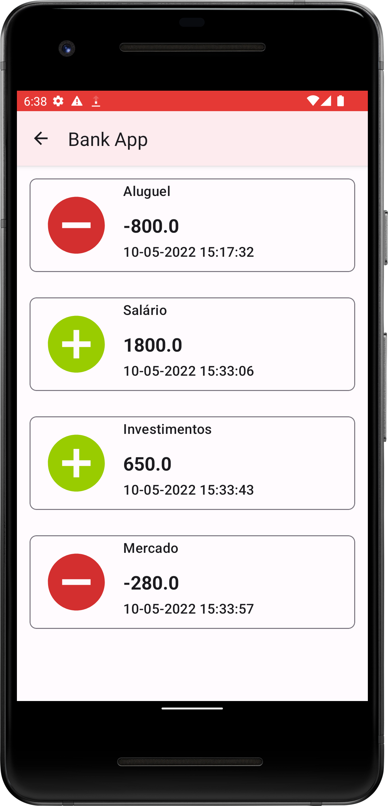
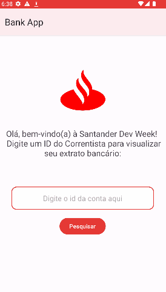

<h1 align="center">Bank App</h1>

<h1 align="center">
  
  
  </h1>
  
  <h1 align="center">
   
  </h1>

<h1 align="center">
   
</h1>

### Sobre :book: 
 Aplicativo feito para consumir a api-bank feita no repositório: [https://github.com/andreesperanca/bank-api], utilizando Retrofit.
 
### Habilidades :star:
- Requisição web com Retrofit;
- Coroutines, ViewModel.

### Tecnologias :rocket:

 - Kotlin 
 - Android Studio
 - Retrofit
 
### Funcionalidades 🛠

- [x] Consultar Movimentações de correntistas.
- [ ] Criar novos correntistas.
- [ ] Criar novas movimentacões.

### Autor

Feito por André Esperança!

Contatos :
 

<a href="https://github.com/andreesperanca">
   
 
  
  <a href="https://github.com/andreesperanca" title="">André Esperança</a>
 
